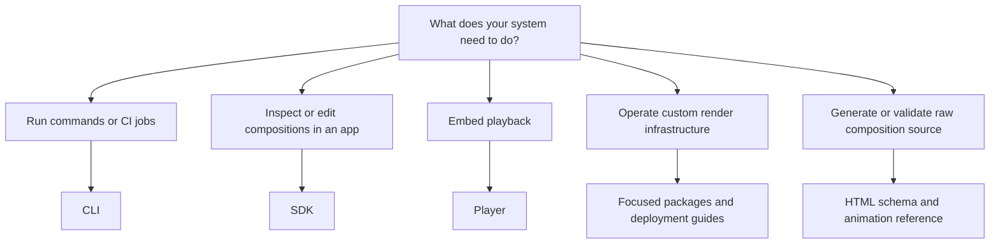

This section is for people integrating HyperFrames, automating it, extending the editor, deploying rendering infrastructure, or working directly with composition source.

If you only want to create or edit a video, begin with [Guides](/guides) or [Studio](/studio).

## Choose the smallest surface

<CardGroup cols={2}>
  <Card title="CLI" icon="terminal" href="/developers/cli">
    Create, check, render, publish, and automate projects from a terminal or CI job.
  </Card>
  <Card title="SDK quickstart" icon="code" href="/sdk/quickstart">
    Open a composition, query or edit it, persist changes, and build custom editing surfaces.
  </Card>
  <Card title="Player" icon="circle-play" href="/packages/player">
    Embed a seekable HyperFrames composition and control playback from an application.
  </Card>
  <Card title="Packages" icon="boxes-stacked" href="/packages/core">
    Add focused parsing, playback, rendering, Studio, or infrastructure capabilities.
  </Card>
  <Card title="Deployment" icon="cloud" href="/deploy/cloud">
    Render with managed cloud infrastructure, AWS Lambda, or Google Cloud Run.
  </Card>
  <Card title="HTML schema" icon="brackets-curly" href="/reference/html-schema">
    Reference composition elements, timing attributes, tracks, variables, and the media contract.
  </Card>
</CardGroup>

## A good first technical result

Choose one result rather than installing the whole repository:

- render one known project from a script or CI job;
- open one composition with the SDK and change one value;
- embed one project with the Player and seek to a timestamp;
- deploy one minimal render path;
- validate one generated composition against the schema.

Continue to package or reference pages only when that working path requires more control. Most integrations should not depend on every HyperFrames package.

## Working on HyperFrames itself?

Use [Contributing](/contributing) for repository setup, tests, Catalog contributions, and releases. Product integrations should begin with one of the surfaces above instead.
